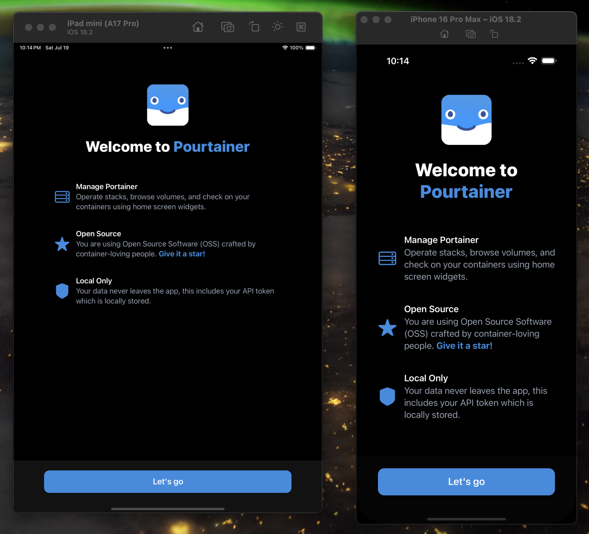
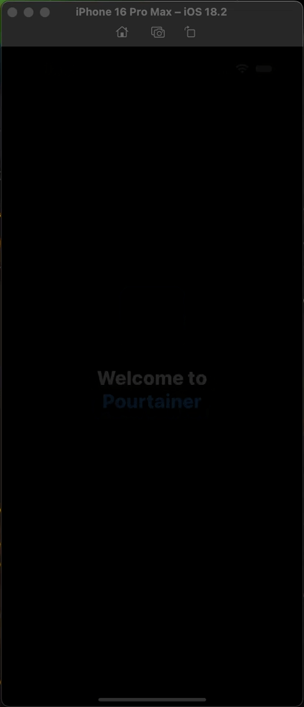

# expo-onboarding

Dead simple onboarding for your React Native/Expo app.

## Installation

```bash
npm install expo-onboarding
```

## Usage

```typescript
import { OnboardingView, OnboardingFeature } from 'expo-onboarding';
import { View, TouchableOpacity, Text } from 'react-native';

const FEATURES: OnboardingFeature[] = [
  {
    title: 'Feature One',
    description: 'This is the first amazing feature of our app. It helps you accomplish great things.',
    systemImage: 'star.fill',
  },
  {
    title: 'Feature Two', 
    description: 'Our second feature with clickable links. Connect with others and share your experience.',
    systemImage: 'heart.fill',
    links: [
      {
        sectionText: 'Connect with others',
        sectionUrl: 'https://example.com',
      },
    ],
  },
];

export default function App() {
  return (
    <View style={{ flex: 1, backgroundColor: 'black', paddingTop: '20%' }}>
      <OnboardingView
        features={FEATURES}
        icon={require('./assets/icon.png')}
        appName="Your App"
        tintColor="blue"
        titleStyle={{}}
        featureTitleStyle={{ color: 'white' }}
        featureDescriptionStyle={{ color: 'gray' }}
        ButtonComponent={() => (
          <TouchableOpacity
            style={{
              backgroundColor: 'blue',
              padding: 15,
              borderRadius: 12,
              width: '80%',
            }}
            onPress={() => console.log('Get started pressed')}
          >
            <Text style={{ color: 'white', textAlign: 'center', fontSize: 18 }}>
              Get Started
            </Text>
          </TouchableOpacity>
        )}
      />
    </View>
  );
}
```

## Peer Dependencies

You should have these packages installed in your project already:

- `expo`
- `react`
- `react-native`  
- `expo-blur`
- `expo-symbols`

## Demo





Note: You are seeing a GIF version of the video recording, so frames are dropped.

## API

### OnboardingViewProps

| Prop | Type | Description |
|------|------|-------------|
| `features` | `OnboardingFeature[]` | Array of features to display |
| `icon` | `ImageSourcePropType` | App icon to display |
| `appName` | `string` | Your app name |
| `tintColor` | `string` | Primary accent color |
| `titleStyle` | `TextStyle` | Styling for app title |
| `featureTitleStyle` | `TextStyle` | Styling for feature titles |
| `featureDescriptionStyle` | `TextStyle` | Styling for feature descriptions |
| `ButtonComponent` | `ComponentType` | Custom button component |

### OnboardingFeature

| Prop | Type | Description |
|------|------|-------------|
| `title` | `string` | Feature title |
| `description` | `string` | Feature description |
| `systemImage` | `SymbolViewProps['name']` | SF Symbol name for iOS |
| `icon?` | `ComponentType` | Custom icon component for Android |
| `links?` | `Array<{sectionText: string, sectionUrl: string}>` | Optional clickable links in description |

## Contributing

Contributions are very welcome! Please refer to guidelines described in the [contributing guide](https://github.com/expo/expo#contributing).

## License

MIT
